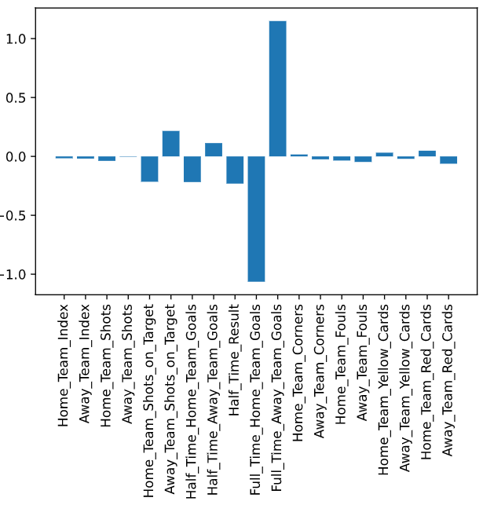
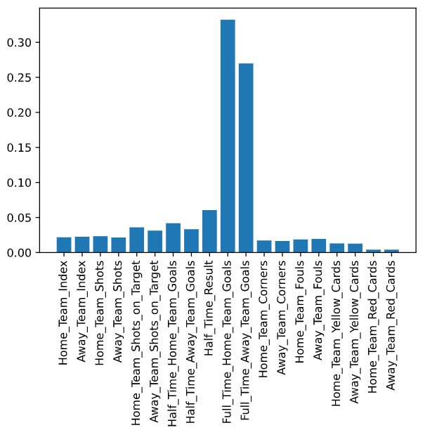
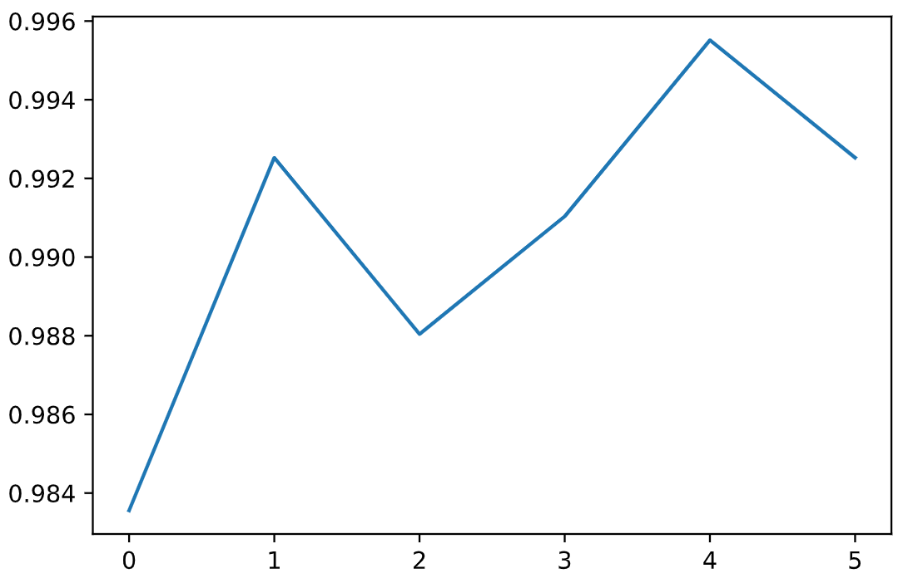

# Analysis of Serie A data

I am using data from the last 10 Serie A seasons, in order to predict this season  
All data from the 2010/2011 season until February 27th, 2021 is being taken into account  

## Step 1: Combine all season data

Combined all 10 csv files from previous seasons into 1 csv to analyze  

## Step 2: Delete all betting columns
Keep:

| Column       | Description                                        |
|--------------|----------------------------------------------------|
| Season       | Season                                             |
| Date	       | Match Date (dd/mm/yy)                              |
| AwayTeam     | Away Team                                          |
| HomeTeam	   | Home Team                                          |
|              |                                                    |
| AS           | Away Team Shots                                    |
| HS	       | Home Team Shots                                    |
| AST          | Away Team Shots on Target                          |
| HST	       | Home Team Shots on Target                          |
| HTAG         | Half Time Away Team Goals                          |
| HTHG	       | Half Time Home Team Goals                          |
| HTR	       | Half Time Result (H=Home Win, D=Draw, A=Away Win)  |
|              | (Dummies)   H=3, D=1, A=0                          |
| FTAG	       | Full Time Away Team Goals                          |
| FTHG	       | Full Time Home Team Goals                          |
| FTR	       | Full Time Result (H=Home Win, D=Draw, A=Away Win)  |
|              | (Dummies)   H=3, D=1, A=0                          |
| AC	       | Away Team Corners                                  |
| HC	       | Home Team Corners                                  |
| AF	       | Away Team Fouls Committed                          |
| HF	       | Home Team Fouls Committed                          |
| AY	       | Away Team Yellow Cards                             |
| HY	       | Home Team Yellow Cards                             |
| AR	       | Away Team Red Cards                                |
| HR	       | Home Team Red Cards                                |  

## Step 3: Correlation

Very obvious anti-correlations, not much learned here  
One thing, away shots on target much less or more than home shots on target. Away team is more varied in shots  

## Step 4: Creating Index for categorical variables

I converted the Half-time and Full time results into ordinal columns, with a home win = 3, a draw = 1, and a home loss = 0  
Made Home and Away teams into numeric values  

Their index:  

|  Home_Team_Index |    Team     |
|------------------|-------------|
| 0                |        None |  
| 1                |    Atalanta |  
| 2                |        Bari |  
| 3                |   Benevento |  
| 4                |     Bologna |  
| 5                |     Brescia |  
| 6                |    Cagliari |
| 7                |       Carpi |
| 8                |     Catania |
| 9                |      Cesena |
| 10               |      Chievo |
| 11               |     Crotone |
| 12               |      Empoli |  
| 13               |  Fiorentina |  
| 14               |   Frosinone |  
| 15               |       Genoa |  
| 16               |       Inter |  
| 17               |    Juventus |  
| 18               |       Lazio |  
| 19               |       Lecce |  
| 20               |     Livorno |  
| 21               |       Milan |  
| 22               |      Napoli |  
| 23               |      Novara |  
| 24               |     Palermo |  
| 25               |       Parma |  
| 26               |     Pescara |  
| 27               |        Roma |  
| 28               |   Sampdoria |  
| 29               |    Sassuolo |  
| 30               |       Siena |  
| 31               |        Spal |  
| 32               |      Spezia |  
| 33               |      Torino |  
| 34               |     Udinese |  
| 35               |      Verona |  

## Step 5: Logistic Regression

I ended up using a softmax regression, as the dependent variable has 3 outcomes  
First normalize the model's x and y, then look at things like accuracy and baseline score. Looked at baseline score as well, pretty poor in comparison  
Using Cohen's score to observe randomness, there is no randomness in our model  

Feature Importance - found that:  
The biggest factor in a home win is Full_Time_Away_Team_Goals, followed by Away_Team_Shots_on_Target  
The biggest factor in home loss is Full_Time_Home_Team_Goals, followed by Half_Time_Result, and Home_Team_Shots_on_Target  

I used Ridge regression instead of lasso to highlight categories that were pretty effective on the dataset  

## Step 6: Random Forest

Used another model called random forest to validate earlier findings. The accuracy, baseline accuracy, and cohen's score were relatively the same  

## Step 7: K-Folds

Use K-folds along with the random forest model so that the model could be tested with "Real-World data" and see how it reacts during every fold  
Was generally pretty solid, model ended at 0.993 accuracy  

## Step 8: Hyperparameters

Used a hyperparameter grid with some out-there parameters so that the model could adjust itself  
An example is features; if I were to run hyper parameters for max_features, and the grid found that 0.05 is a better parameter, it would mean that most of my categories were useless  

## Step 9: Predictions

Used the values from the random forest predictions (could have also used Soft-Max Regression)  
I combined these predictions to the index for the Home Teams made earlier)  

The final table looks like this:  

| Position |    Club    |  Points  |  
|----------|------------|----------|  
| 1        |   Juventus |    92    |  
| 2        |       Roma |    91    |  
| 3        |     Napoli |    83    |  
| 4        |      Inter |    77    |  
| 5        |      Milan |    73    |  
| 6        |  Sampdoria |    58    |  
| 7        |      Lazio |    58    |  
| 8        |      Genoa |    49    |  
| 9        | Fiorentina |    49    |  
| 10       |   Atalanta |    49    |  
| 11       |   Cagliari |    44    |  
| 12       |      Parma |    36    |  
| 13       |    Udinese |    35    |  
| 14       |    Bologna |    34    |  
| 15       |     Torino |    27    |  
| 16       |    Palermo |    26    |  
| 17       |   Sassuolo |    21    |  
| 18       |     Chievo |    21    |  
| 19       |     Empoli |    15    |  
| 20       |    Catania |    15    |  

## Issues I came across

1. The final table I revealed came up with had 35 teams, which I then had to cut to 20 teams. Surprisingly the table still looks very realistic, so I assume that the extra games taken into account would mean that the final table could have had less points. The teams at the bottom had almost no points, so I also assume that they were not taken into account much by the model purely because they were in the 2nd division for most of that time  

2. I was not able to make a prediction that used only the most recent season's data. When I tried, it ended up with way fewer points than I wanted  

3. There seemed ot be no randomness in my model which is concerning, and I fear thi sis because the model is only using the training data and not the test data  

This was my first attempt at something like this, so I will focus on improving this more and more, either with better data or more recent data. If you have any suggestions please let me know!  

